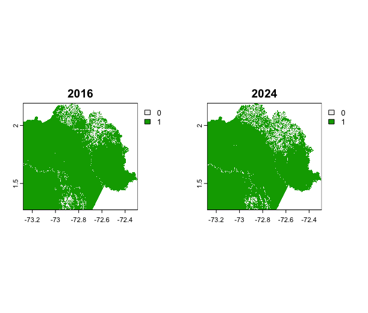

# Introduction

The project analyses deforestation in the Colombian Amazon region between 2016 and 2024, integrating spatial analysis and temporal visualization. 
The code in R processes shapefiles and raster data to show the progressive loss of forest cover. 
The area of interest is the department of Guaviare, where there were plans to build a 162 km road through the jungle between Calamar and Miraflores, with the aim of connecting local communities.
However, the construction of the road facilitated massive deforestation to make way for pastures and livestock farms. 
As a result, the dominant economic sector shifted from agriculture to livestock farming, encouraging the influx of people from outside the region and pushing the local population to sell their land.
Furthermore, the road is now poorly maintained and almost impassable during the rainy season.

## Project setup 

Load the necessary packages and set the working directory.

```
library(terra)
library(raster)
library(rgdal)
library(sf)

setwd("/Users/mattiafabris/Desktop/progetto R esame")
```

## NDVI Image Import

Import NDVI satellite images for 2016 and 2024.

```
ndvi2016 <- rast("2016-01-17-00_00_2016-01-17-23_59_Sentinel-2_L1C_NDVI.tiff")
ndvi2024 <- rast("2024-01-10-00_00_2024-01-10-23_59_Sentinel-2_L1C_NDVI.tiff")

par(mfrow = c(1, 2))
plot(ndvi2016, main = "2016")
plot(ndvi2024, main = "2024")
```


## NDVI Classification

Classify the rasters into binary images to highlight low-vegetation areas (NDVI ≤ 0.2).

```
reclass_matrix <- matrix(c(-Inf, 0.2, 1,   # from -Inf to 0.2 → value 1
                           0.2, Inf, 0),  # from 0.2 to Inf  → value 0
                         ncol = 3, byrow = TRUE)

classed.2016 <- classify(ndvi2016, reclass_matrix)[[1]]
classed.2024 <- classify(ndvi2024, reclass_matrix)[[1]]

par(mfrow = c(1, 2))
plot(classed.2016, main = "Classified NDVI 2016")
plot(classed.2024, main = "Classified NDVI 2024")
```


## Cropping to the Study Area

Import the shapefile defining the Amazon study area and crop the rasters accordingly.

```
shp <- st_read("/Users/mattiafabris/Desktop/progetto R esame")
area <- st_area(shp)
areakm <- area / 1e6

cut.2016 <- crop(classed.2016, shp)
final2016 <- mask(cut.2016, shp)

cut.2024 <- crop(classed.2024, shp)
final2024 <- mask(cut.2024, shp)

par(mfrow = c(1, 2))
plot(final2016, main = "2016")
plot(final2024, main = "2024")
```


## Deforestation Quantification

Calculate the pixel value frequencies and the percentage of deforested areas.

```
f2016 <- freq(final2016)
f2024 <- freq(final2024)

n2016 <- ncell(final2016)
n2024 <- ncell(final2024)

p2016 <- f2016[["count"]] / n2016 * 100
p2024 <- f2024[["count"]] / n2024 * 100
```

The results obtained are the following

```
> f2016
  layer value  count
1     1     0  42677
2     1     1 528217
> f2024
  layer value  count
1     1     0  51651
2     1     1 519243

> n2016
[1] 767260
> n2024
[1] 767260

> p2016
[1]  5.562261 
> p2024
[1]  6.731877 
```
In this way, we can see that the rate of deforestation in 2016 was 5.562261%, while in 2024 it rose to 6.731877%.

## Change and Rate Calculations

Compute the total deforested area and the rate of increase over time.

```
def2016 <- areakm * p2016 / 100
def2024 <- areakm * p2024 / 100

aumento.def <- def2024 - def2016
annual_rate <- aumento.def / 8
daily_rate <- aumento.def / (8 * 365)

cat("Deforested area in 2016: ", round(def2016, 2), "km²\n")
cat("Deforested area in 2024: ", round(def2024, 2), "km²\n")
cat("Total increase: ", round(aumento.def, 2), "km²\n")
cat("Annual rate: ", round(annual_rate, 2), "km²/year\n")
cat("Daily rate: ", round(daily_rate, 4), "km²/day\n")
```
Resulting in the following output
```
Deforested area in 2016:  757.14 km²
Deforested area in 2024:  916.35 km²
Total increase:  159.21 km²
Annual rate: 19.9 km²/year
Daily rate:  0.0545 km²/day
```
